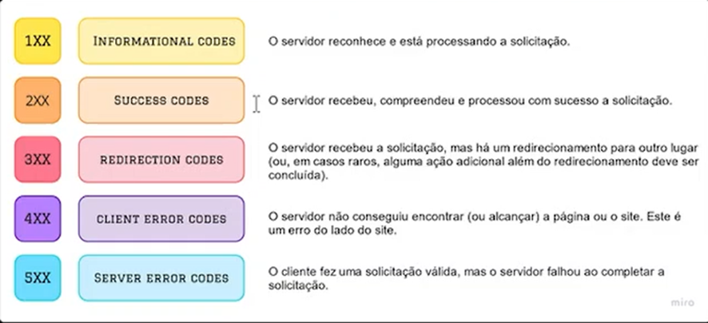

## 1º Utilização de substantivos em rotas
Quando projetamos rotas para APIs, um dos principios fundamentais é usar substantivos plurais para representar recursos. Isso ajuda a manter um API clara, intuitiva e consistente.

## 2º Utilização de métodos HTTP
São fundamentais para a comunicação entre clientes e servidores na web. Eles definem a ação que eles querem realizar no servidor.

## 3º Hierarquia e Aninhamento em rotas
Ajuda a criar URLs mais intuitivas, significando que a estrutura das URLs reflitam a relação entre os recursos que estamos manipulando.

## 4º Nomes de ações
É essencial boas práticas para que os endpoints sejam intuitivos e fáceis de usar. Um dos princípios chave é a não utilização de verbos ou ações nos URLs. Em vez disso, devemos utilizar o método HTTP apropriado (GET, POST, PUT/PATCH, DELETE) para indicar a ção que queremos realizar.

## 5º Versionamento de rotas
Permite que você faça mudanças na API sem afetar os clientes que dependem de versões anteriores. Ou seja, permite que você mantenha múltiplas versões da API em paralelo. Cada versão de API é identificada com um número de versão que é incluído na URL das rotas.

## 6º Parâmetros de consulta
Ou Query parameters, são parte da URL que permite que informações adicionais sejam enviadas para um servidor. Eles são usados para filtrar, paginar e ordenar dados, entre outras funções. Esses parâmetros são anexados à URL após um ponto de interrogação, e múltiplos parâmetros são separados pelo “e” comercial (&).

## 7º Tratamento de erros
O que são códigos de status HTTP? São mensagens enviadas pelo servidor para o cliente após o processamento de uma requisição. Eles indicam se requisição foi bem sucedida, se houve erro ou se algo precisa ser corrigido.

